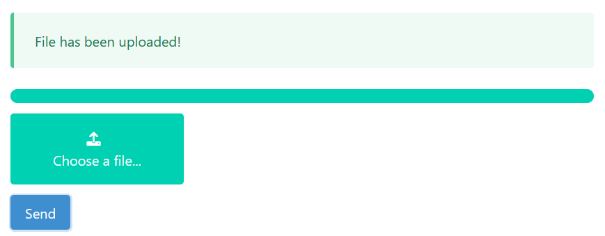

# vuejs-file-upload

## About
File uploader with progressbar. Written in Vue and PHP.

## Project setup
```
npm install
```
Move `backend` folder content to HTTP Server with PHP installed.

### Compiles and hot-reloads for development
```
npm run serve
```

### Compiles and minifies for production
```
npm run build
```

### Preview

